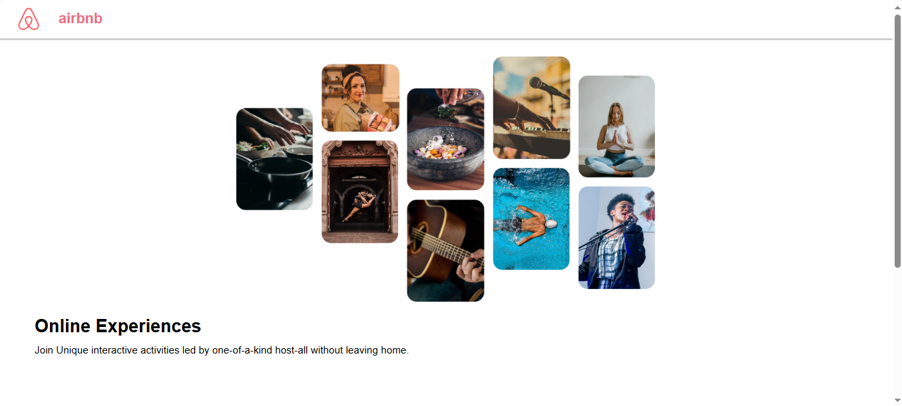

# An-AirBnB-Experiences-UI 🌏

# Features 🚀

-Dynamic Content Rendering: Experience data is dynamically displayed using mock JSON or JavaScript objects.

-Reusable Components: Includes modular components like ExperienceCard for displaying individual experiences.

-Responsive Design: Styled for desktop and mobile views to ensure a good user experience.

-Props Usage: Implements React props for passing data to components.

-Static Images: Uses local images or online links to replicate the look and feel of an Airbnb-style experience page.

# Tech Stack 🎡

-React.js: Front-end library for building the UI.

-CSS/Flexbox: For styling and layout.

-JavaScript (ES6): For logic and interactivity.

# Output 📷

